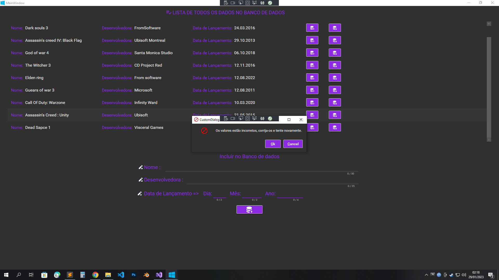

# App Desktop CRUD SQlite

Este é um exemplo de um App Desktop utilizando WPF, possui conexão com banco de dados sqlite, usando o Entity-framework com crud de exemplo.

Não há muito o que dizer construi esse projeto mais por questões de aprendizado, me ajudou a entender os conceitos da ferramenta.

